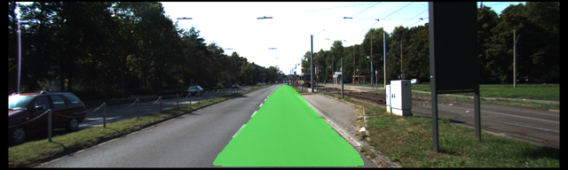
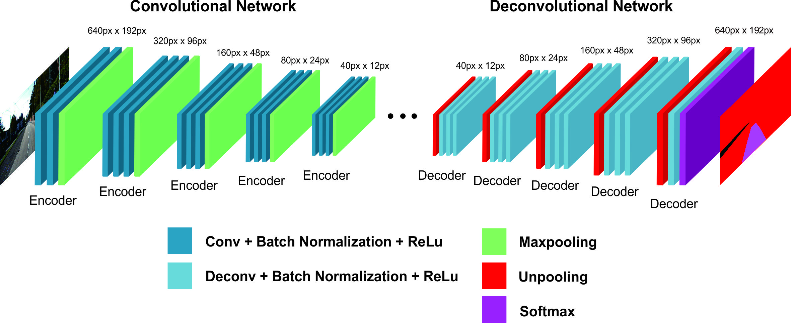
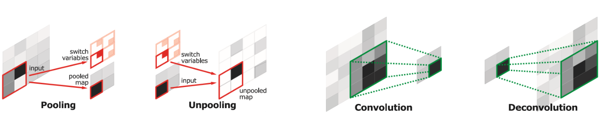

# Road Lane Segmentation using Deconvolutional Neural Network

## Overview
This project solve computer vision problem on detecting and segmenting the drivable road lane from images taken from driver’s perspective camera (example shown below). This project aims to help the development of camera-based Lane Departure Warning (LDW) system. 

## Background
Lane departure warning (LDW) system attached to modern vehicles is responsible for lowering car accident caused by inappropriate lane changing behaviour. However the success of LDW system depends on how well it define and segment the drivable ego lane. As the development of deep learning methods, the expensive light detection and ranging (LIDAR) guided system is now replaced by analysis of digital images captured by low-cost camera. Numerous method has been applied to address this problem. However, most approach only focusing on achieving segmentation accuracy, while in the real implementation of LDW, computational time is also an importance metric. This project focuses on utilizing deconvolutional neural network to generate accurate road lane segmentation in a real-time fashion.

## Approach
In order to segment the drivable road lane for the driver, we employ an Encoder-Decoder architecture that comprise convolutional neural network and deconvolutional neural network. As the name suggest, the architecture consists of two parts as shown on image below. 

The convolutional neural network and maxpooling layers in encoder parts plays role in generating segmentation map from given input image through iterative learning. This will output a spatially smaller segmentation maps since the operation in the convolution and maxpooling shrink the input size. In order to upsample segmentation map back to its input size, the decoder part use unpooling and deconvolutional neural network that the function can be described as follows : 

- **Unpooling:**
Unpooling operation is used to increase the generated segmentation by placing pixel from small space to higher space. The placement is based on the location of maxima on its corresponding maxpooling operation (last maxpooling operation will be reference for first unpooling operation). Unpooling results an image in larger size. However these outputs are sparse.

- **Deconvolution:**
The deconvolutional layer takes sparse input and produce dense output. This done by learning filters to produce correct higher dimensional output when multiplied by lower dimensional input.

(*Noh, H., Hong, S. and Han, B., 2015. Learning deconvolution network for semantic segmentation.*)
## Publication
This project was accepted in The 3rd International Conference on Soft Computing in Data Science and published in Communications in Computer and Information Science, Springer.

DOI :  https://doi.org/10.1007/978-981-10-7242-0_2
